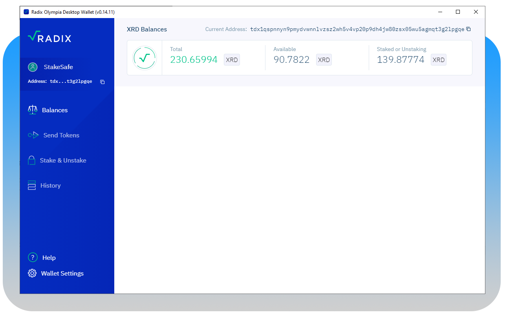
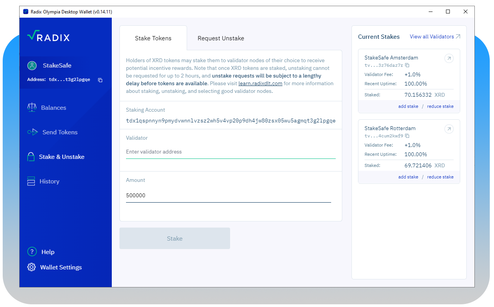
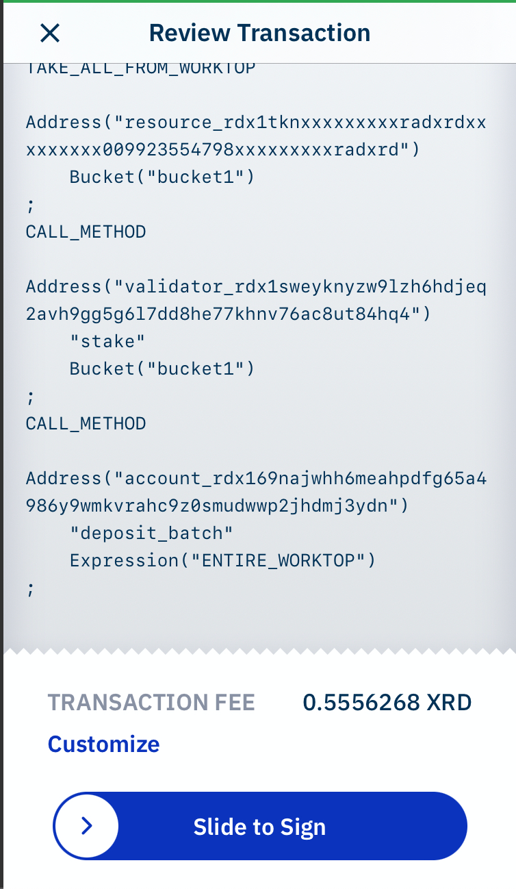

## Welcome to Goxrd.com Pages

Our Validators  
[Our nodes](https://explorer.radixdlt.com/#/validators/rv1qgg8n2f8ddrfc5927rjh0rykkw2m5apqkaw6pcsxtmzk4086al77vs3rtxh) are running on Radix Olympia Mainnet!
#RadixMainnetIsLive

Staking in the Radix network is essential to protect network security. The Radix network is operated by validator node-runners like StakeSafe who participate in the consensus on transactions and code run on the network.

As an XRD staker you delegate your tokens to validator node-runners and instantly receive rewards for your participation of making the network safe. Its therefore essential to choose your validators wisely since because in case a validator does not perform up to standard, your stake (rewards) might be penalized for incorrect consensus or downtime

### Stake Flow

#### Radix Wallet
To start with staking start the Radix Wallet and go to Stake & Unstake in the menu

#### Stake & Unstake
Enter the address of one of our validators in the validator field. Type the desired XRD amount in the amount field.
Our Node Address: `rv1qgg8n2f8ddrfc5927rjh0rykkw2m5apqkaw6pcsxtmzk4086al77vs3rtxh`

#### Confirm
Confirm to stake your tokens with us. You need to confirm this transaction with your pincode.

### Support or Contact

Having trouble with Stake/Unstake? Check out our [documentation](https://docs.github.com/categories/github-pages-basics/) or [contact support](https://support.github.com/contact) and we’ll help you sort it out.
