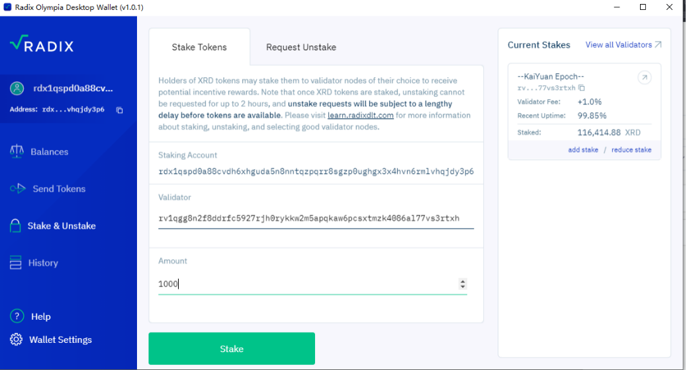

## KaiYuan Epoch Validator Node

## About Kaiyuan Validator
[KaiYuan Epoch](https://explorer.radixdlt.com/#/validators/rv1qgg8n2f8ddrfc5927rjh0rykkw2m5apqkaw6pcsxtmzk4086al77vs3rtxh) is a leading Top 50 Validator running on Radix Mainnet from August, 2021, Also we are one of Validator of early Radix Mainet Beta test.

Kaiyuan Epoch provide  stable and Secure staking service with low fee for our customers from UK, USA ,China, Spain etc. Kaiyuan staking Service is featured by over 5 Radix OG also.

Being a senior Ambassador of Radix, Kaiyuan team work with his customers to translate Serials Radix White Paper Including Radix DeFi, Economic Model and Cerberus into Chinese version from 2021 to 2022.

KaiYuan Epoch believe Radix will be the King of Layer 1 after Bitcoin and Etherum, We Look forward to witnessing the great moment of Radix Roadmap Xi’ an releasing.

## Why We call KaiYuan Epoch?

Xi’ an is capital of Tang Dynasty in China, Meanwhile KaiYuan Epoch is most brilliant period in Tang Dynasty through long China history. So this is reason why we named.

Stake with KaiYuan ,Go to Xi' an together!
    
    
## What is Staking
Staking in the Radix network is essential to protect network security. The Radix network is operated by validator node-runners like StakeSafe who participate in the consensus on transactions and code run on the network.

As an XRD staker you delegate your tokens to validator node-runners and instantly receive rewards for your participation of making the network safe. Its therefore essential to choose your validators wisely since because in case a validator does not perform up to standard, your stake (rewards) might be penalized for incorrect consensus or downtime.

### Stake Flow

#### Radix Wallet
To start with staking start the Radix Wallet and go to Stake & Unstake in the menu.

#### Stake & Unstake
Enter the address of one of our validators in the validator field. Type the desired XRD amount in the amount field. Our Validator Address: `rv1qgg8n2f8ddrfc5927rjh0rykkw2m5apqkaw6pcsxtmzk4086al77vs3rtxh`

#### Confirm
Confirm to stake your tokens with us. You need to confirm this transaction with your Pin code.

### Support or Contact

Having trouble with Stake/Unstake? Check out our [documentation](https://www.radixdlt.com/post/radix-staking-and-incentive-rewards-guide) or [contact support](https://twitter.com/Kaiyuanepoch) and we’ll help you sort it out.

